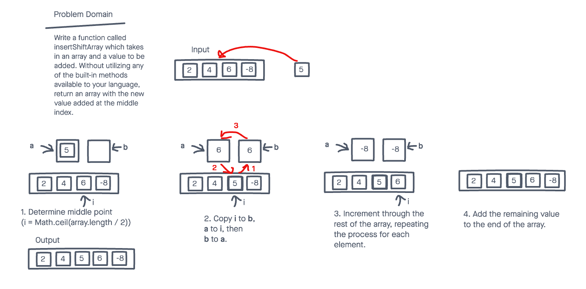

# Insert to Middle of an Array

Write a function called insertShiftArray which takes in an array and a value to be added. Without utilizing any of the built-in methods available to your language, return an array with the new value added at the middle index.

## Whiteboard Process

## Approach and Efficiency

I decided to use a placeholder variable, and swap values one at a time, from the insertion point to the end. With this approach, half of the elements in the array are touched exactly three times, providing a linear O(n) time complexity, with a constant O(1) storage complexity.