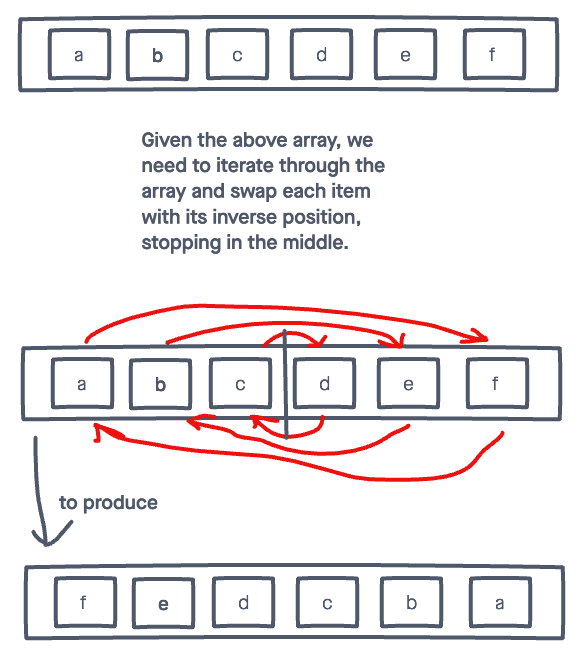

# Reverse Array

Write a function called reverseArray which takes an array as an argument. Without utilizing any of the built-in methods available to your language, return an array with elements in reversed order.

## Inputs / Outputs

Input: `[a, b, c, d, e, f]`  
Output: `[f, e, d, c, b, a]`

## Algorithm

If we can grab the ends of the array, we can just swap their values.
* Use a for loop to look at all of the elements in the array.
* For each item in the array, swap the opposite (inverse) array index.
* Only go half-way, so items don't get swapped back.

## Psuedocode

```plaintext

function reverseArray takes in 'arr':

    declare start <- 0;
    declare end <- length of array minus 1;

    while start <= end:
        declare temp <- arr[start]
        arr[start] <- arr[end]
        arr[end] <- temp
        start = start + 1
        end = end - 1

```

## Actual Code

## Visual

