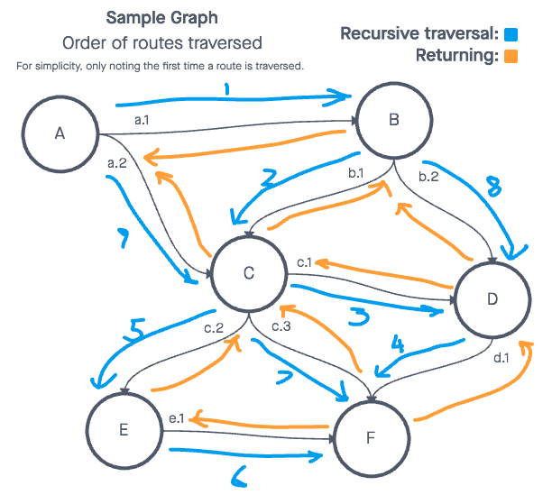

# Challenge Summary

Conduct a depth first preorder traversal on a graph

## Features

Write the following method for the Graph class:

- Name: Depth first
  - Arguments: Node (Starting point of search)
  - Return: A collection of nodes in their pre-order depth-first traversal order
  - Program output: Display the collection

## Approach & Efficiency

This is a hefty algorithm, with O(n^n) complexity.

## UML



## Solution

To view the passing tests, run:

```node test graph-depth-first```

in the console.