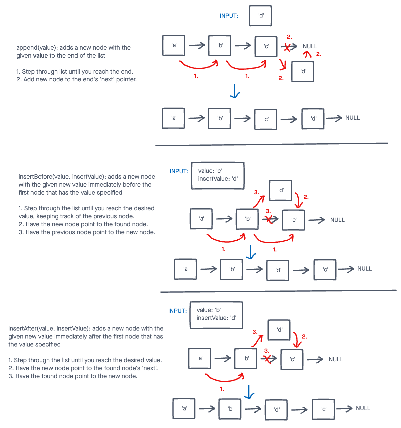

# Challenge Summary

Write the following methods for the Linked List class:

* append
  * arguments: new value
    * adds a new node with the given value to the end of the list
  * insert before
    * arguments: value, new value
    * adds a new node with the given new value immediately before the first node that has the value specified
  * insert after
    * arguments: value, new value
    * adds a new node with the given new value immediately after the first node that has the value specified

## Whiteboard Process



## Approach & Efficiency

I stepped through the list for each method, resulting in O(n) for time complexity, and O(1) for space complexity.

## Solution

To view the passing tests, run:

```node test linked-list-insertions```

in the console.