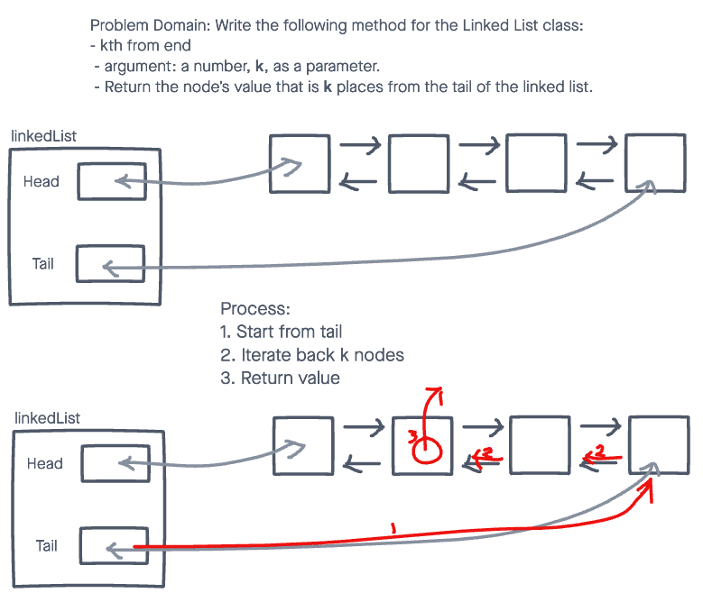

# Challenge Summary

Write the following method for the Linked List class:

* kth from end
  * argument: a number, k, as a parameter.
  * Return the node’s value that is k places from the tail of the linked list.

## Whiteboard Process



## Approach & Efficiency

I stepped through the list for each method, resulting in O(n) for time complexity, and O(1) for space complexity.

## Solution

To view the passing tests, run:

```node test linked-list-kth```

in the console.