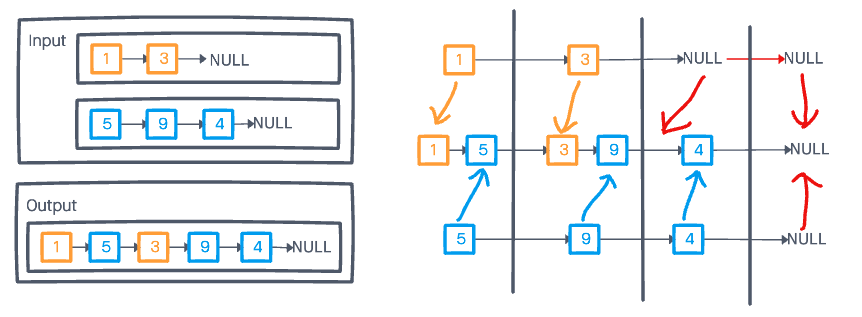

# Challenge Summary

* Write a function called zip lists
  * Arguments: 2 linked lists
  * Return: Linked List, zipped as noted below
  * Zip the two linked lists together into one so that the nodes alternate between the two lists and return a reference to the head of the zipped list.

## Example

zipLists(list1, list2)

| Arg list1 | Arg list2 |	Output |
|-|-|-|
| `head -> [1] -> [3] -> [2] -> X` | `head -> [5] -> [9] -> [4] -> X` | `head -> [1] -> [5] -> [3] -> [9] -> [2] -> [4] -> X` |
| `head -> [1] -> [3] -> X` | `head -> [5] -> [9] -> [4] -> X` | `head -> [1] -> [5] -> [3] -> [9] -> [4] -> X` |
| `head -> [1] -> [3] -> [2] -> X` | `head -> [5] -> [9] -> X` | `head -> [1] -> [5] -> [3] -> [9] -> [2] -> X` |

## Whiteboard Process



## Approach & Efficiency

The zip function steps through each linked list simultaneously, resulting in a linear time complexity, O(n), dependent on the length of the longest input. The space complexity is also linear, as it depends on the length of each input.

## Solution

To view the passing tests, run:

```node test linked-list-zip```

in the console.