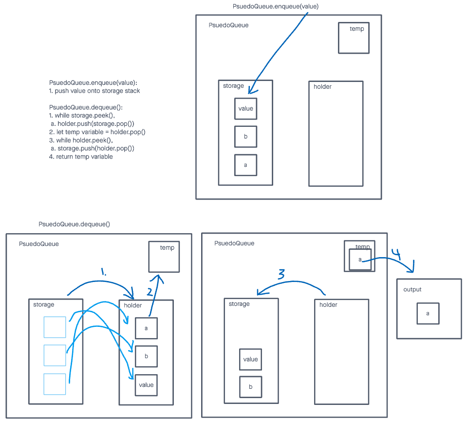

# Challenge Summary

## Features

* Create a new class called pseudo queue.
  * Do not use an existing Queue.
  * Instead, this PseudoQueue class will implement our standard queue interface (the two methods listed below),
  * Internally, utilize 2 Stack instances to create and manage the queue
* Methods:
  * enqueue
    * Arguments: value
    * Inserts value into the PseudoQueue, using a first-in, first-out approach.
  * dequeue
    * Arguments: none
    * Extracts a value from the PseudoQueue, using a first-in, first-out approach.

NOTE: The Stack instances have only push, pop, and peek methods.

## Example

enqueue(value)
| Input | Args | Output |
|-|-|-|
| [10]->[15]->[20] | 5 | [5]->[10]->[15]->[20] |
| | 5 | [5] |

dequeue()
| Input | Output | Internal State |
|-|-|-|
| [5]->[10]->[15]->[20] | 20 | [5]->[10]->[15] |
| [5]->[10]->[15] | 15 | [5]->[10] |

## Whiteboard Process



## Solution

To view the passing tests, run:

```node test stack-queue-pseudo```

in the console.