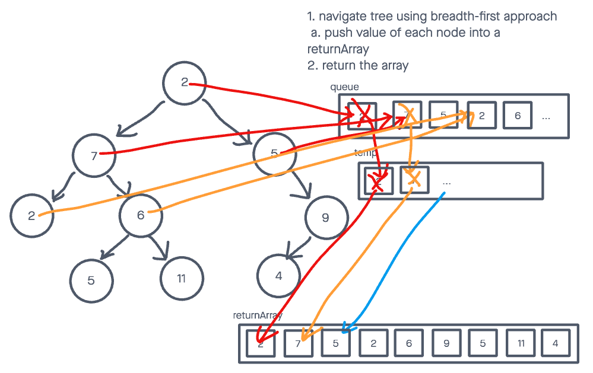

# Challenge Summary

## Features

* Write a function called breadth first
  * Arguments: tree
  * Return: list of all values in the tree, in the order they were encountered

## Example

Input:


Output: ```[2,7,5,2,6,9,5,11,4]```

## Whiteboard Process



## Solution

To view the passing tests, run:

```node test tree-breadth-first```

in the console.