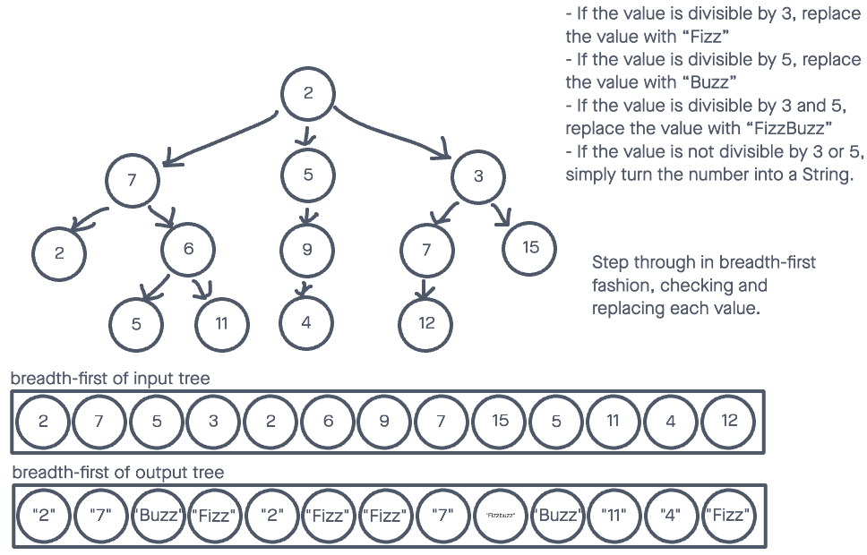

# Challenge Summary

## Features

* Write a function called fizz buzz tree
  * Arguments: k-ary tree
  * Return: new k-ary tree

Determine whether or not the value of each node is divisible by 3, 5 or both. Create a new tree with the same structure as the original, but the values modified as follows:

* If the value is divisible by 3, replace the value with “Fizz”
* If the value is divisible by 5, replace the value with “Buzz”
* If the value is divisible by 3 and 5, replace the value with “FizzBuzz”
* If the value is not divisible by 3 or 5, simply turn the number into a String.

## Whiteboard Process



## Solution

I had to modify my approach to allow a new tree to be returned, rather than just changing the values in the original tree.

To view the passing tests, run:

```node test tree-fizz-buzz```

in the console.