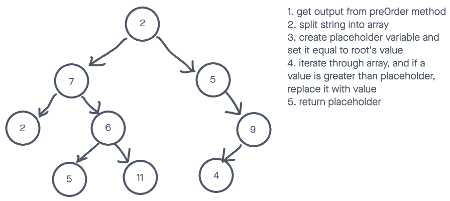

# Challenge Summary

## Features

Write the following method for the Binary Tree class

* find maximum value
  * Arguments: none
  * Returns: number

Find the maximum value stored in the tree. You can assume that the values stored in the Binary Tree will be numeric.

## Example

Input:


Output: ```11```

## Whiteboard Process



## Solution

To view the passing tests, run:

```node test tree-max```

in the console.